<p align="center">
  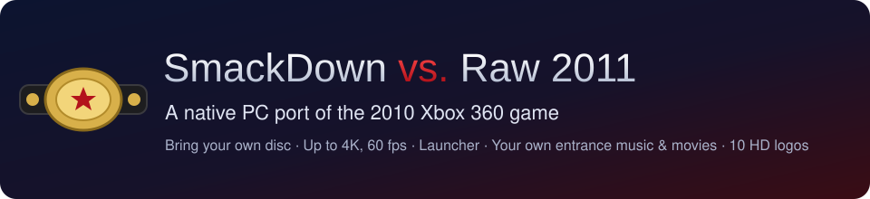
</p>

# WWE SmackDown vs. Raw 2011 — PC Port

This is a native Windows port of the 2010 Xbox 360 game *WWE SmackDown vs. Raw 2011*. It isn't an emulator. The game's code is statically recompiled to C++ with the [ReXGlue SDK](https://github.com/rexglue/rexglue-sdk) and built into an ordinary Windows program. It runs on the SDK's Xenia-derived runtime, draws with Direct3D 12, plays sound through XAudio2 and reads controllers through XInput.

It also adds:

- **Sharp resolutions**: 720p (the console's), 900p, 1080p, 1440p and 4K, with anti-aliasing, VSync and a steady 60 fps.
- **A launcher** that installs the game from your disc image, keeps it up to date, and manages settings, saves, DLC, logos and movies.
- **Your own entrance music**: *Create An Entrance → Music → USER PLAYLIST* plays songs from a folder on your PC, as the Xbox 360 did from its hard drive.
- **Your own entrance movies**: turn any video into a titantron movie in the launcher and pick it in *Create An Entrance*.
- **Up to 10 HD logos** on a created superstar, instead of the game's limit of 2.
- **Paint Tool import and export**: put any image into the game's Paint Tool, or save its logos as PNGs.
- **Type on your PC keyboard** wherever the game shows its on-screen keyboard: superstar names, Story Designer text and more.
- **Saves as plain files** that you can back up, copy and share.
- **An experimental Vulkan renderer**: the native renderer on Vulkan as well as Direct3D 12 (Settings → Renderer → *Native Vulkan (EXPERIMENTAL)*), the groundwork for Linux and Android.

> [!IMPORTANT]
> **This repository has no game in it.** It holds no disc image, XEX, game data, movies, music or recompiled game code. You need your **own copy of the Xbox 360 game**. Make a disc image of it (`.iso`), then point the launcher at that image.

> [!NOTE]
> **This port was made with [Claude Code](https://claude.com/claude-code)**, Anthropic's AI coding assistant. Claude Code wrote most of the port's code, tools and docs, working with the project's human author, who directed, tested and played it. See [Contributors](#contributors).

---

## Screenshots

<table>
  <tr>
    <td width="50%">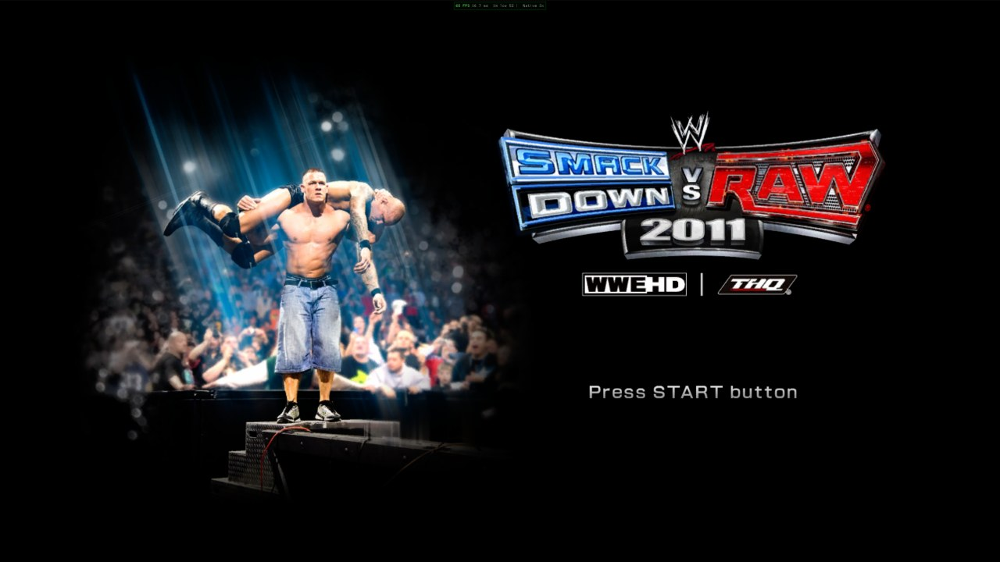<br><sub><b>Title screen</b></sub></td>
    <td width="50%">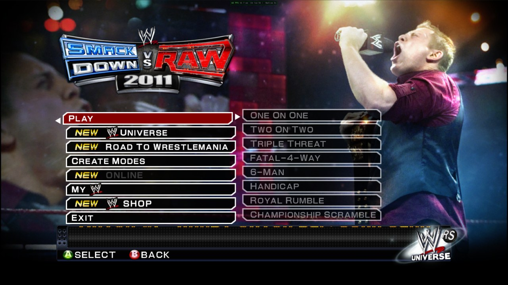<br><sub><b>Main menu</b>, with the port's <b>EXIT</b> entry</sub></td>
  </tr>
  <tr>
    <td>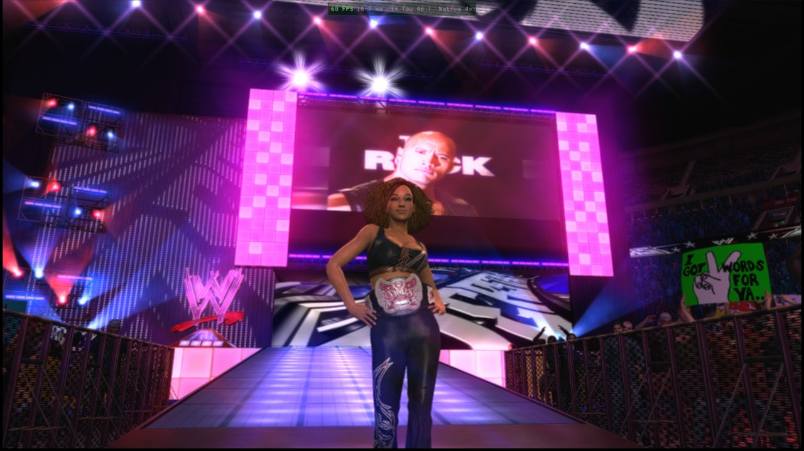<br><sub><b>Your own entrance movie</b> on the big screen</sub></td>
    <td>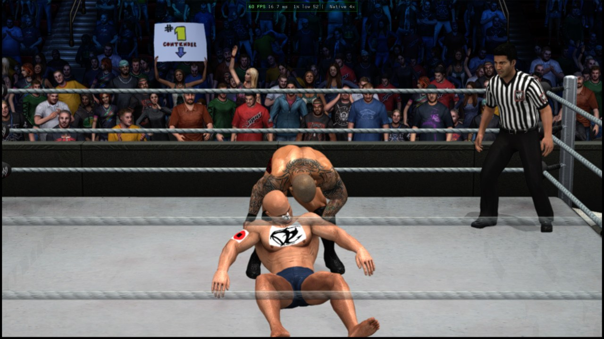<br><sub><b>A created superstar</b> wearing four HD logos, in a match</sub></td>
  </tr>
  <tr>
    <td>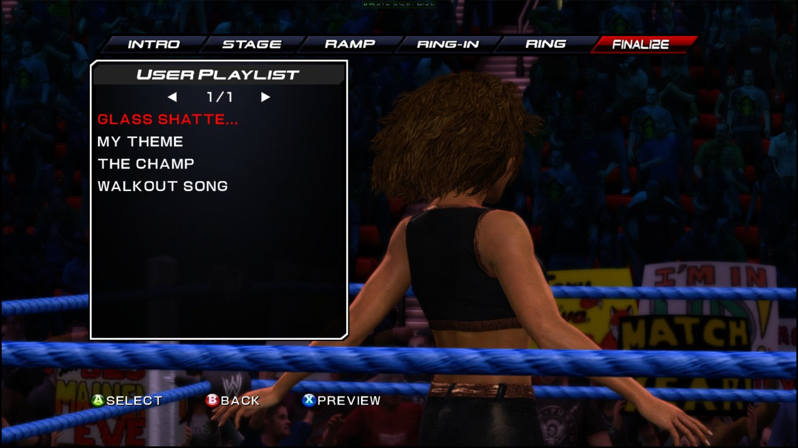<br><sub><b>USER PLAYLIST</b>: songs from your Music folder</sub></td>
    <td>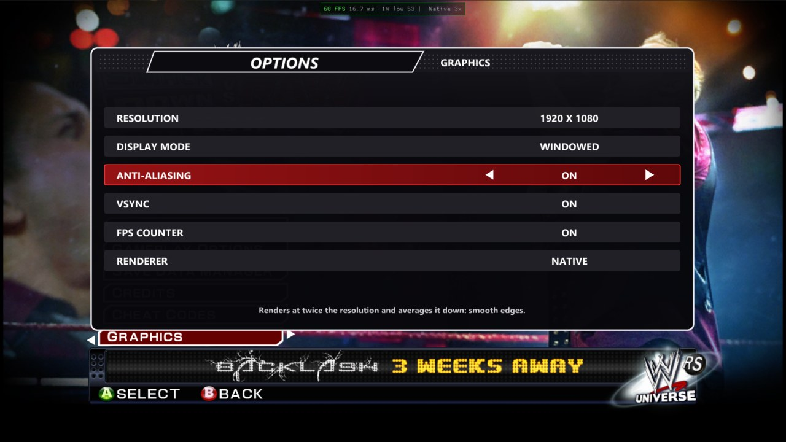<br><sub><b>Graphics options</b> in <i>My WWE → Options</i></sub></td>
  </tr>
</table>

---

## Contents

- [Screenshots](#screenshots)
- [What you need](#what-you-need)
- [Install and play](#install-and-play)
- [Controls](#controls)
- [Updates](#updates)
- [Steam Deck and Linux (Proton)](#steam-deck-and-linux-proton)
- [Android (experimental)](#android-experimental)
- [Settings](#settings)
- [Features](#features)
  - [Entrance music from your PC](#entrance-music-from-your-pc)
  - [Custom entrance movies](#custom-entrance-movies)
  - [Up to 10 HD logos per superstar](#up-to-10-hd-logos-per-superstar)
  - [Paint Tool import and export](#paint-tool-import-and-export)
  - [Saves](#saves)
  - [DLC](#dlc)
- [Building from source](#building-from-source)
- [Troubleshooting](#troubleshooting)
- [Contributors](#contributors)
- [Legal and credits](#legal-and-credits)

---

## What you need

| | |
|---|---|
| 💿 **The game** | A disc image of your own *WWE SmackDown vs. Raw 2011* **Xbox 360** disc, as an `.iso`. The PS3, Wii, PS2 and PSP versions won't work. |
| 🖥️ **PC** | Windows 10 or 11 (64-bit). A graphics card with Direct3D 12. A CPU from about 2009 or later (SSE4.2). It also runs on a **Steam Deck** (55–60 fps) and Linux PCs through Proton: see [Steam Deck and Linux](#steam-deck-and-linux-proton). |
| 💾 **Disk space** | About 6 GB: 5.3 GB for the game, plus room for saves and caches. |
| 🎮 **Controller** | An Xbox controller (Xbox 360, Xbox One or Series). Other gamepads work through SDL. |

---

## Install and play

<p align="center">
  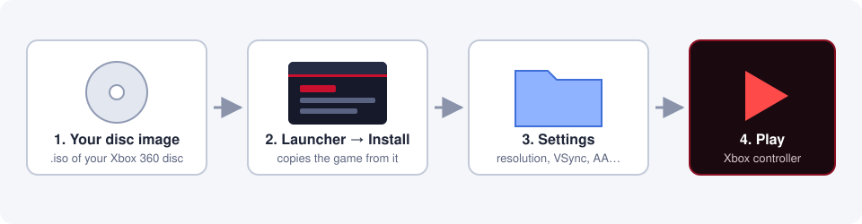
</p>

1. **Download** the latest zip from [**Releases**](https://github.com/KaikoClanworth1/wwe-svr2011-pc/releases/latest) and unzip it anywhere. It holds the launcher and the game program, with no game data.
2. **Make a disc image** of your Xbox 360 game disc, as an `.iso`.
3. **Open `SvR2011 Launcher.exe`** and go to the **Install** tab:
   1. Under **Your disc image**, choose your `.iso`.
   2. Under **Install to**, choose an empty folder.
   3. Click **Install**. The launcher only reads the image and never changes it. It copies the game out (about 5.3 GB) and puts the PC program beside it. If you stop it, click **Install** again later and it carries on where it left off.
4. **Settings tab**: pick windowed or fullscreen, the resolution, VSync and so on.
5. **Play tab**: press **Play**.

Your saves go to `Saves\` inside the game folder.

<table>
  <tr>
    <td width="50%">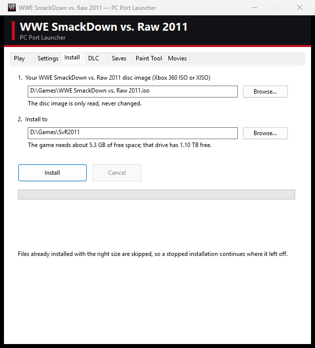<br><sub><b>Install</b>: choose your disc image and a folder</sub></td>
    <td width="50%">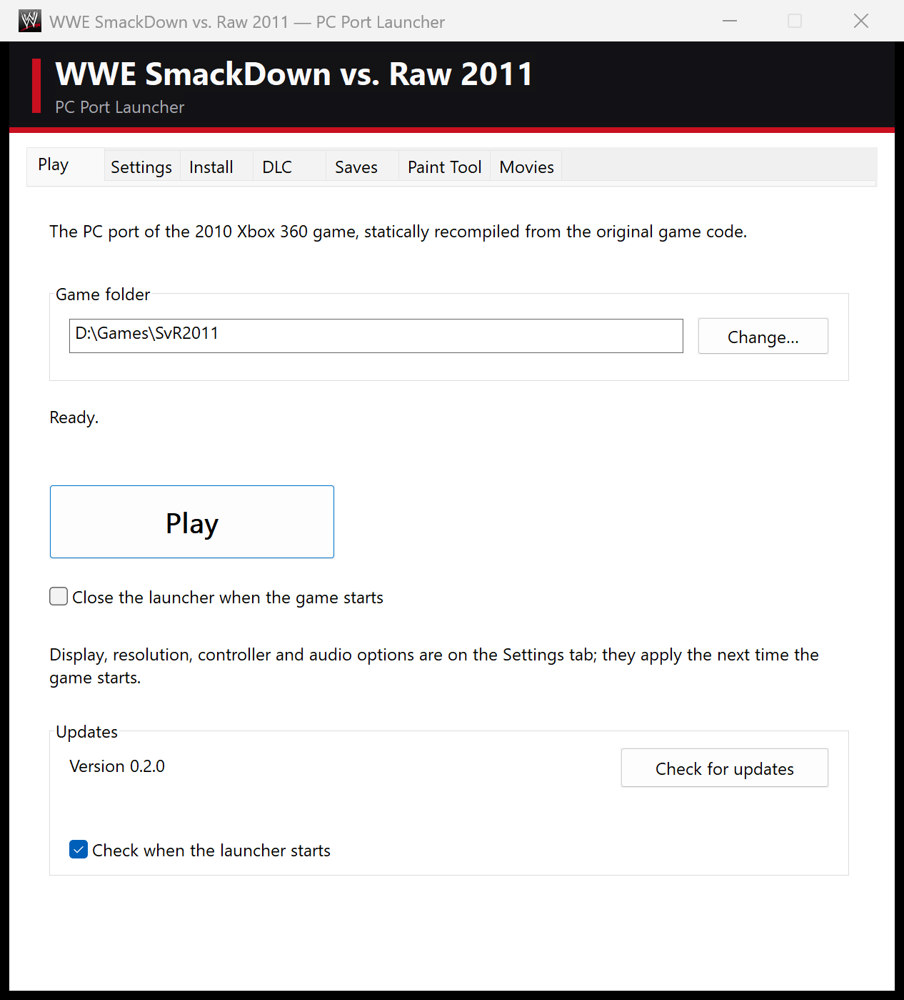<br><sub><b>Play</b></sub></td>
  </tr>
</table>

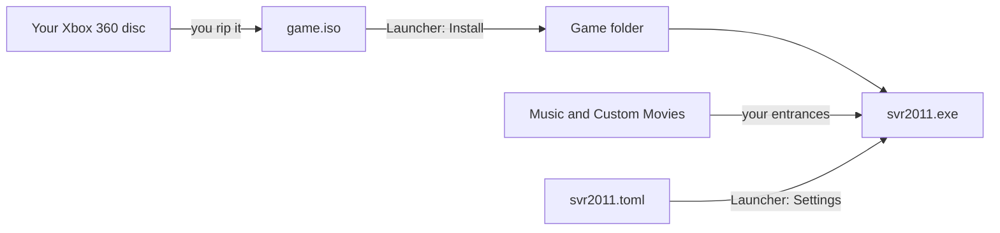

### Updates

From version 0.2.0 the launcher **updates itself**. When it starts, it checks this repository's releases. If there's a newer one, it asks, downloads it, replaces the program files and restarts. Your saves, settings, music and movies are kept. The **Updates** box on the **Play** tab shows your version, has a **Check for updates** button, and can turn the check at start off.

**Coming from v0.1.0:** that version has no updater. Download v0.2.0 once, unzip it, open its launcher, and click **Install** into your game folder. Files already there are skipped.

### Steam Deck and Linux (Proton)

The port is a Windows program. On a Steam Deck or a Linux PC it runs through **Proton**, Steam's compatibility layer, with the native renderer at **55–60 fps on a Steam Deck**. Linux PCs other than the Deck haven't been tested yet. If something goes wrong, please [report](https://github.com/KaikoClanworth1/wwe-svr2011-pc/issues) it with the newest file from the game folder's `logs` folder.

**Set up (Desktop Mode):**

1. Download the latest zip from [Releases](https://github.com/KaikoClanworth1/wwe-svr2011-pc/releases/latest) and unzip it, for example into `~/Games/SvR2011-PC`. Copy your `.iso` onto the Deck or its SD card.
2. In Steam: **Games → Add a Non-Steam Game to My Library → Browse**. Set the file type to **All Files** and choose `SvR2011 Launcher.exe`.
3. In that entry's **Properties → Compatibility**, tick **Force the use of a specific Steam Play compatibility tool** and pick **Proton Experimental** (or the newest Proton).
4. Start it from Steam and use the **Install** tab as on Windows. In the file dialogs your Linux files are on drive **Z:**, for example `Z:\home\deck\Games`.

**Play in Game Mode:** add the game folder's `svr2011.exe` as another non-Steam game and force Proton on it the same way. It starts straight into the game with the Deck's controls, and is fullscreen by default on a Deck. You can also keep using the launcher entry and press **Play** (use the trackpad or touchscreen).

**Tips:**

- **Typing names:** press **Steam + X** for the Deck's keyboard. It types into the game's on-screen keyboard.
- **Entrance music:** MP3 is the safest format under Proton.
- **Custom movies:** the launcher's movie maker may not read every video format under Proton. If a video won't convert, convert it on a Windows PC, or try an H.264 `.mp4`.
- **Something draws wrong:** in the launcher's **Settings**, set **Renderer** to **Emulated** and compare.
- **Updates:** launchers before v0.2.3 can't unpack updates under Proton (they used Windows' `tar.exe`, which Proton lacks) and stop with "Could not unpack the update". Update once by hand: download the latest zip, unzip it over your launcher's folder (or unzip it anywhere, run its launcher and click **Install** into your game folder). From v0.2.3 on, updates work under Proton too.
- **DLC:** under Proton the launcher can unpack `.zip` DLC archives but not `.rar` or `.7z`. Unpack those first, or add the unpacked folder.

### Android (experimental)

The game runs on Android phones and tablets with a 64-bit ARM chip and Vulkan, such as a recent Snapdragon. On a Galaxy Z Fold 7 it holds 60 fps. You need about 7 GB free on the phone and a controller. First install the game on your PC as above. Then use the launcher's **Android** tab:

- **Option 1: install over USB (recommended).**
  1. On the phone, open **Settings → About phone** (on Samsung, also **→ Software information**) and tap **Build number** 7 times, until it says developer mode is on.
  2. Open **Settings → Developer options** and turn on **USB debugging**.
  3. Connect the phone with a USB data cable and unlock it. When it asks *Allow USB debugging?*, tick *Always allow from this computer* and tap **Allow**.
  4. Click **Install to phone**. The first time, the launcher downloads adb, Google's Android tool (about 7 MB).

  The game goes into the phone's `games/WWE SmackDown vs. Raw 2011` folder and starts. Run it again after a launcher update: it copies only what changed and keeps the phone's saves.
- **Option 2: a package to copy yourself.** **Create APK Package** makes a folder with `SvR2011.apk`, `SvR2011-Game.zip` and instructions. Copy both files to the phone's **Download** folder and open the APK to install it. On first start the app installs the game from the zip; you can delete the zip afterwards.

On the phone, the game renders at the Xbox 360's 720p. **MY WWE → Options → Graphics → Resolution** raises it, and anti-aliasing can be turned on there.

---

## Controls

Play with an Xbox controller. The layout is exactly as on the Xbox 360.

**While playing:**

| Key | What it does |
|---|---|
| `F2` | Shows or hides the FPS counter. |
| `F3` | Performance overlay. |
| `F4` | The runtime's settings overlay. |
| `` ` `` | Console and log. |

**Typing:** whenever the game's on-screen keyboard is open (superstar names, Story Designer, and so on), you can type on your PC keyboard as well as use the controller. `Backspace` deletes, `←` `→` move the cursor, `Enter` confirms and `Esc` cancels.

The game's main menu has an **EXIT** entry at the bottom.

---

## Settings

You can change these in the launcher's **Settings** tab. **Resolution**, **Display mode**, **Anti-aliasing**, **VSync**, **FPS counter** and **Renderer** are also in the game itself, under **My WWE → Options → Graphics**. Everything is saved in `svr2011.toml` beside the exe.

| Setting | What it does |
|---|---|
| **Windowed / Fullscreen** | Fullscreen is borderless. |
| **Resolution** | 1280×720 is the console's own output and the default. 1600×900, 1920×1080, 2560×1440 and 3840×2160 render the game at a higher internal resolution. |
| **VSync** | Waits for the monitor's refresh, so the picture doesn't tear. On by default. |
| **Anti-aliasing** | Renders at twice the resolution and averages it down, for smoother edges. It costs GPU time. |
| **Renderer** | **Native** (recommended) draws the game's Direct3D calls directly. **Emulated** emulates the Xbox 360's graphics chip, as Xenia does. Try it if something looks wrong, and please report it. **Native Vulkan (EXPERIMENTAL)** is the native renderer on Vulkan instead of Direct3D 12 (the groundwork for Linux and Android); it needs a Vulkan 1.2 GPU and falls back to emulated drawing if it can't start. |
| **Show FPS** | The frame-rate counter at the top of the window (`F2` in game). |
| **Controller API** | **XInput** for Xbox controllers, or **SDL** for other gamepads. |
| **Audio output** | **XAudio2** (recommended; 5.1 on surround setups, stereo otherwise) or **SDL**. **Mute** silences the game. |

<p align="center">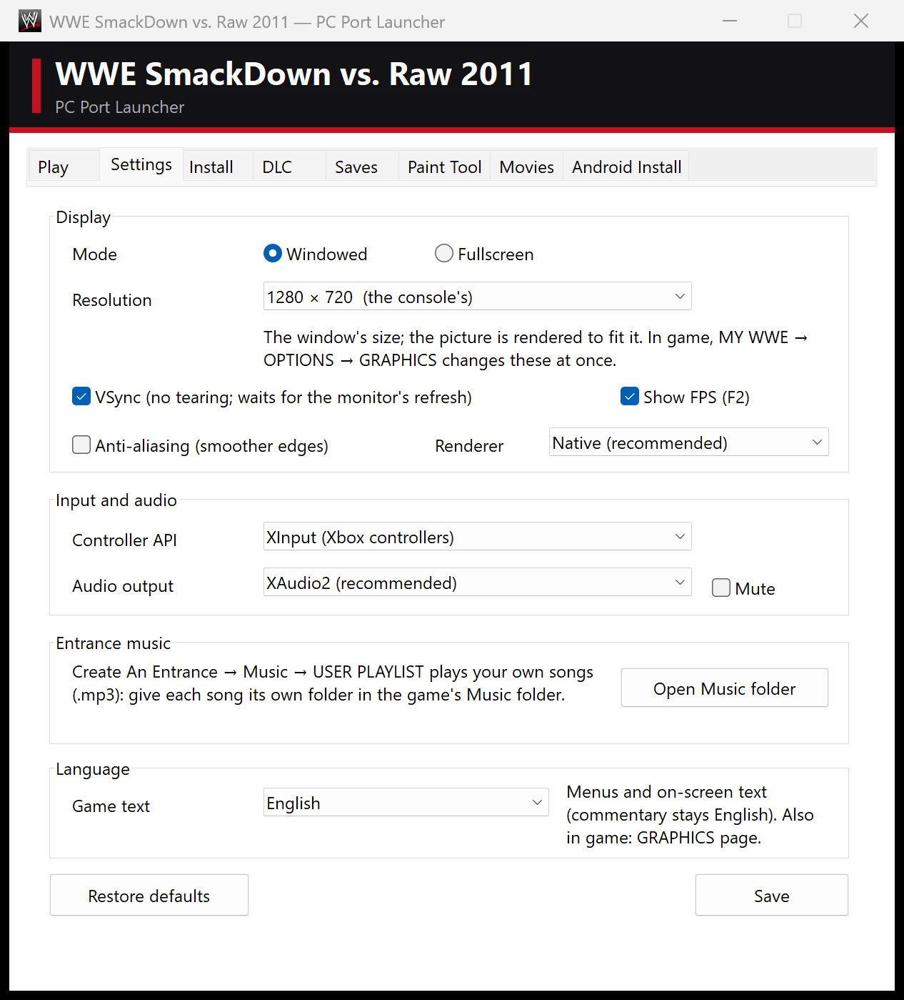</p>

---

## Features

<p align="center">
  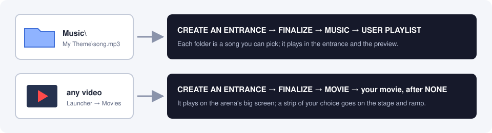
</p>

### Entrance music from your PC

On the Xbox 360, *Create An Entrance → Finalize → Music → **USER PLAYLIST*** played songs from the console's hard drive. On PC, it plays them from the **`Music`** folder in the game folder. The launcher's **Settings → Open Music folder** button opens it.

```
Music\
  My Theme\
    song.mp3        listed as MY THEME
  The Champ\
    entrance.m4a    listed as THE CHAMP
  Walkout.mp3       a song put straight in Music is listed by its file name
```

- Give each song **its own folder**. The folder's name is what the game lists.
- `.mp3`, `.wma`, `.m4a`, `.aac`, `.wav` and `.flac` all work.
- The entrance remembers the song by name, so **don't rename a folder that an entrance uses**.
- The song plays in the entrance and in the preview (**X**). The game's own music lowers while it plays, as on the console.

<p align="center"></p>

### Custom entrance movies

The launcher's **Movies** tab turns any video Windows can play (`.mp4`, `.mov`, `.wmv`, …) into an entrance movie for the arena's big screen.

<p align="center">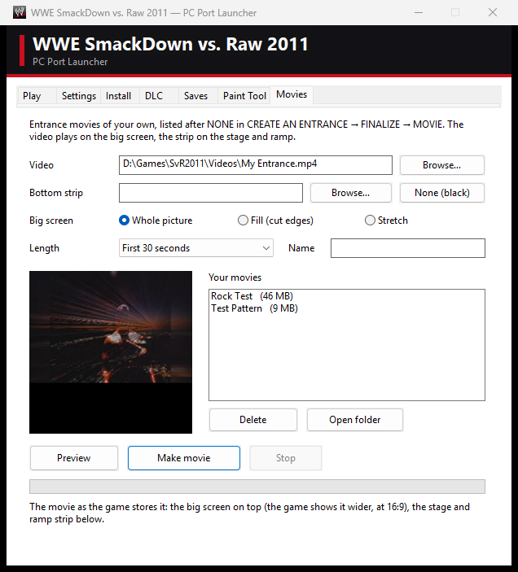</p>

1. Under **Video**, choose your video. A frame from it shows in the preview. You can also choose a movie you made before (a `.bik` in `Custom Movies`) to make it again, for example with **Fill the screen**.
2. Under **Bottom strip**, choose what the stage and ramp screens show: a picture or a video (**Browse…**), **Superstar…** to reuse a superstar's animated strip from the game's own movie (DLC superstars included), or **None (black)**.
3. Choose how the video fits the big screen: **Fill the screen** (the default: the video covers the whole screen, cutting off a little at the edges if its shape differs), **Whole picture** (black bars if needed) or **Stretch**. Black bars that are already in the video (letterboxed or 4:3 videos) are found and cut off first.
4. Pick a **Length**, give the movie a **Name**, and click **Make movie**. A 30-second movie takes a few seconds to make.
5. In the game: *Create An Entrance → Finalize → **Movie** → **USER MOVIES***, like *Music → USER PLAYLIST*. It lists your movies by name (and any saved highlight reels after them). **X** previews one, **A** picks it.

The movies are saved in the **`Custom Movies`** folder in the game folder, in the same format and layout as the game's own titantron movies. Don't rename a movie that an entrance uses (`Custom Movies\ids.txt` remembers which number each one has).

<table>
  <tr>
    <td width="50%">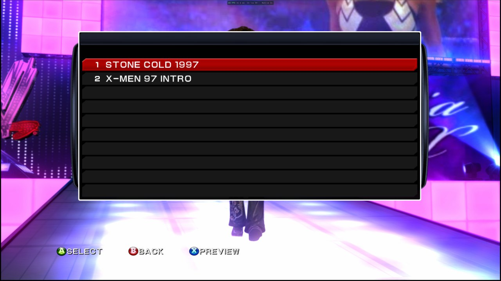<br><sub><b>Movie → USER MOVIES</b> lists your movies</sub></td>
    <td width="50%"><br><sub>…and on the big screen during the entrance</sub></td>
  </tr>
</table>

### Up to 10 HD logos per superstar

The game lets a created superstar wear only **2** different High Resolution (256×256) Paint Tool logos. The port raises that to **10**, so you can put a different logo on the head, chest, back, arms, legs and clothing.

- Logos 1 and 2 are stored in the superstar's save as usual. Logos 3 to 10 are kept in the hidden **`Saves\.logos`** folder, and the launcher's backups include it.
- If you copy or share a superstar's save file by hand, **copy `Saves\.logos` with it**, or logos 3 and up will be blank.
- The game's other rules stay: Low Resolution (128×128) logos stay at 10, and the two sizes can't be mixed on one superstar.
- **Tip:** a superstar's **Entrance Attire** and **Cinematic Attire** are separate outfits. If you don't edit them, entrances and cutscenes use the game's default gear. To see the full costume in the entrance, build it in *Other → Edit Entrance Attire* too.

<table>
  <tr>
    <td width="50%">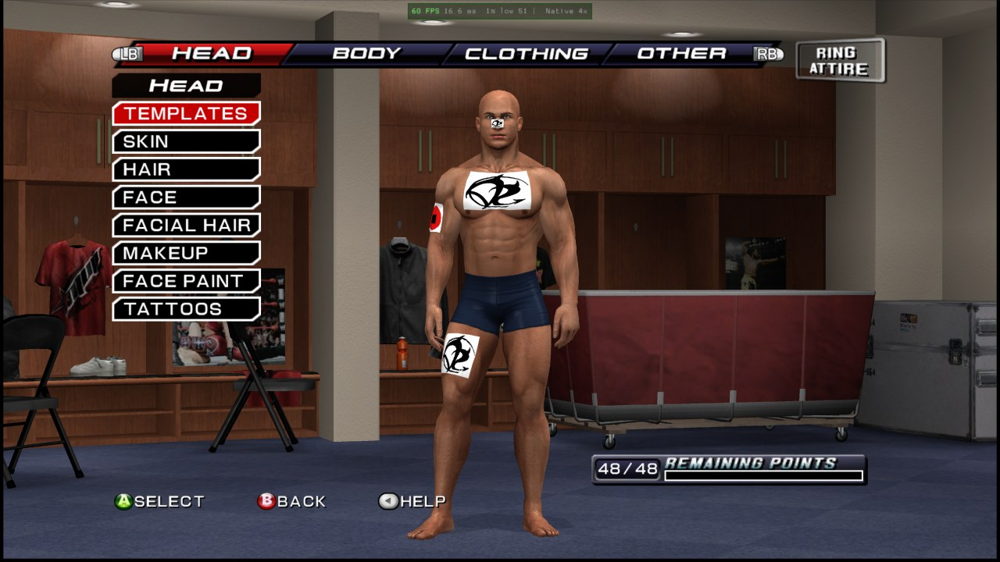<br><sub><b>Create A Superstar</b>: four different HD logos</sub></td>
    <td width="50%"><br><sub>The same superstar in a match</sub></td>
  </tr>
</table>

### Paint Tool import and export

The launcher's **Paint Tool** tab shows the game's 20 Paint Tool logos.

- **Import image…** puts any picture into a logo. It's fitted into 256×256 and keeps its transparency. The game then shows and edits it like any logo.
- **Export PNG…** and **Export all…** save logos as PNGs.
- **Delete logo** empties a slot.

The Paint Tool save is created the first time you open *Create A Superstar → Paint Tool* in the game.

<p align="center">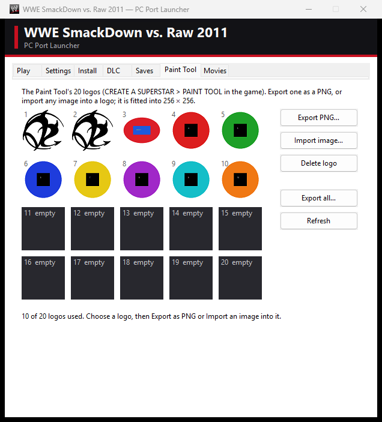</p>

### Saves

Every save is **one plain file** in the `Saves\` folder. Close the game before you copy them.

| File | What it holds |
|---|---|
| `SaveData.dat` | The main save: settings, unlocks and progress. It ties the others together, so keep them with it. |
| `00CreateSuperStar.cas`, `01…` | Created superstars. |
| `00PaintTool.pt` | Paint Tool logos. |
| `00RecordingDat.rec` | Replays. |
| `00SceneDat.scn` | Highlight reels. |

The launcher's **Saves** tab lists them. You can **Back up all** (to `SaveBackups\`), **Restore backup**, **Export** or **Import** single saves, **Delete** (to the Recycle Bin) and open the folder. Restoring or importing backs up your current saves first.

<p align="center">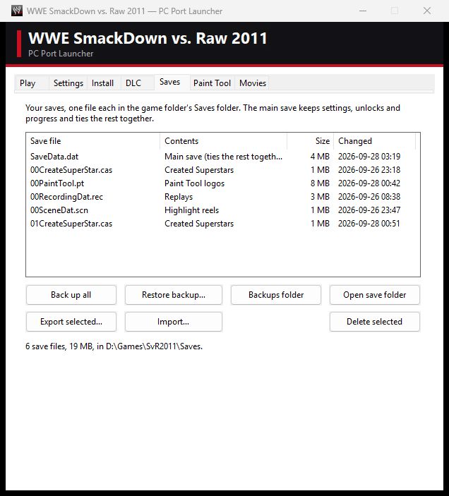</p>

### DLC

Downloadable content from the Xbox 360 (superstars, moves, arenas) works. In the launcher's **DLC** tab, choose the folder with your DLC packages, as downloaded on the console. `.zip`, `.rar` and `.7z` archives of them work too. Click **Install DLC**. The packages are copied into the game's `DLC\` folder and unpacked the next time the game starts. Title updates aren't needed and are skipped.

<p align="center">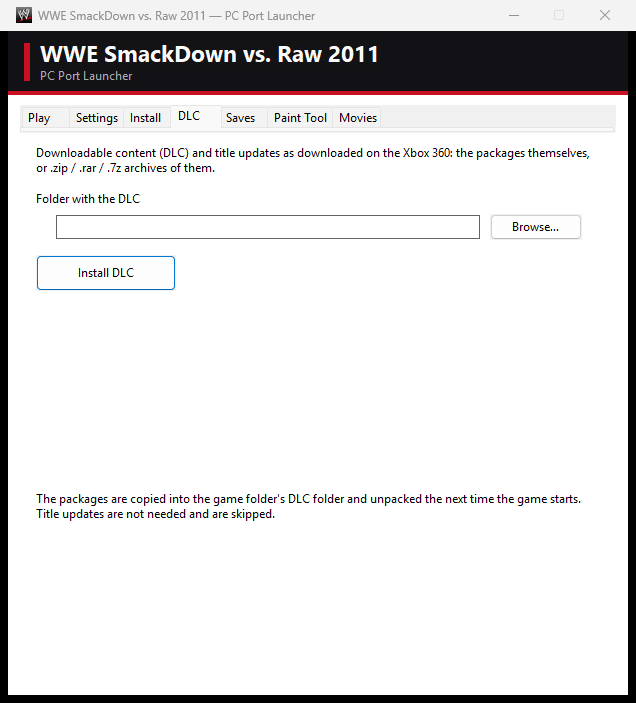</p>

---

## Building from source

The recompiled game code is **generated on your machine from your own disc**. It isn't stored here.

**You need:**

- **Windows 10 or 11**, 64-bit.
- **LLVM** (`clang`, `clang++` and `llvm-rc`) in `C:\Program Files\LLVM\bin`.
- **CMake 3.25** or newer, and **Ninja**.
- **Git** and **Python 3** with Pillow: run `pip install pillow`.
- **PowerShell**.

**Steps** (run them from the repository root):

1. Get the **ReXGlue SDK** source into `recomp\rexglue-sdk`, at the commit this port was built against (its v0.10.0 release commit):
   ```bash
   git clone https://github.com/rexglue/rexglue-sdk recomp/rexglue-sdk
   ```
   ```bash
   git -C recomp/rexglue-sdk checkout c94f5ebdcb3c9d1a460ca48e04f9758448f8d518
   ```
   ```bash
   git -C recomp/rexglue-sdk submodule update --init --recursive
   ```
2. Apply this port's runtime fixes to the SDK:
   ```bash
   git -C recomp/rexglue-sdk apply ../../port/patches/rexglue-sdk-svr2011.patch
   ```
   And get **plume** (the graphics layer the native renderer draws through) into `recomp\plume`, with this port's additions:
   ```bash
   git clone --recursive https://github.com/renderbag/plume.git recomp/plume
   ```
   ```bash
   git -C recomp/plume checkout d72379344dacd3dbf9f810f92ddc87e6de1845b1
   ```
   ```bash
   git -C recomp/plume submodule update --init --recursive
   ```
   ```bash
   git -C recomp/plume apply ../../port/patches/plume-svr2011.patch
   ```
3. Get the **ReXGlue codegen tool**: download `rexglue-sdk-0.10.0-win-amd64.zip` from the [ReXGlue releases](https://github.com/rexglue/rexglue-sdk/releases/tag/v0.10.0) and unzip it into `recomp\sdk\win-amd64`.
4. Put **`ninja.exe`** in `recomp\bin`, or anywhere on your `PATH`.
5. Copy **`default.xex`** from your disc (or from an install made by the launcher) into `port\assets\`.
6. Optionally, make the **program icon** from your game files:
   ```bash
   python port/tools/make_icon.py "path/to/your/game folder"
   ```
7. **Generate** the C++ code from your `default.xex` (about a minute):
   ```bash
   cd port && ../recomp/sdk/win-amd64/bin/rexglue.exe codegen svr2011_manifest.toml
   ```
8. **Build** (the first build takes a while):
   ```bash
   powershell -ExecutionPolicy Bypass -File port/build.ps1
   ```
9. Optionally, the **native renderer's shaders**: they're converted from the game's own shaders as it creates them (a capture build, then `port/tools/convert_shaders.py`, which makes DXIL for Direct3D 12 and SPIR-V for Vulkan; see `port/docs/native_renderer_phase2.md`). Without them the game uses the emulated renderer.
10. **Make a release zip**, with no game data in it, then install it with its launcher as in [Install and play](#install-and-play):
   ```bash
   powershell -ExecutionPolicy Bypass -File port/tools/package.ps1
   ```

**Android (work in progress, not yet tested on a phone):** the same code cross-compiled for arm64 with the Android NDK, drawn with the Vulkan renderer. You need JDK 17 and the Android SDK command-line tools with `ndk;30.0.16248370`, `build-tools;36.1.0` and `platforms;android-36`. Set `JAVA_HOME` and `ANDROID_HOME` if they're not in `D:\Android`. Gradle isn't needed. Build the SDK for Windows first (step 8, which makes the `rexglue.exe` code generator), then run:
```bash
python port/tools/build_apk.py
```
This makes `port/out/android/SvR2011.apk`, which holds no game data. The package script ships it beside the launcher as `Android\SvR2011.apk`. The launcher's **Install → Create APK Package** puts it next to a zip of the installed game. On first start, the app installs that zip into the phone's `games` folder.

**Repository layout:**

| Path | What's there |
|---|---|
| `port/src/` | The PC side: the app, audio, input, saves, DLC, menus, the graphics page, entrance music and movies, the extra logos, crash reports and the native renderer. |
| `port/launcher/` | The Win32 launcher (Play, Settings, Install, DLC, Saves, Paint Tool and Movies tabs), including the Bink movie encoder and the Android packager. |
| `port/android/` | The Android app's manifest, icons and Java activities (the game runs in SDL's activity). |
| `port/patches/` | Fixes to the ReXGlue SDK's runtime that this game needs. |
| `port/tools/` | Build, packaging and analysis scripts, and the background test harness. |
| `port/svr2011_manifest.toml`, `port/svr2011_config.toml` | The codegen project and its per-game settings. |

---

## Troubleshooting

- **The install fails.** Check that the image is a full disc image of the **Xbox 360** version, and that the target drive has enough free space (the Install tab shows it).
- **The game closed unexpectedly.** A crash report is saved in `UserData\crashes\` in the game folder. Please include it when you report a problem.
- **Black screen with sound (v0.1.0).** v0.1.0's zip was missing the native renderer's shaders. Update to v0.2.0 or later. The game now also falls back to the **Emulated** renderer if the `native_shaders` folder is missing.
- **"The Created Superstar save data is either damaged or missing" after copying saves.** Choose **NO**, then update to v0.2.1 or later: it rebuilds the save headers that some copy tools leave out (the `Saves\.info` folder), and copies the whole `Saves` folder from then on.
- **Very low frame rate or no picture on a laptop.** Laptops with two GPUs could run the game on the built-in one. v0.2.1 picks the fast GPU. With older versions, set `svr2011.exe` to **High performance** in Windows Settings → System → Display → Graphics.
- **Something is drawn wrong.** In the launcher's **Settings**, set **Renderer** to **Emulated** and see if it looks right there. Either way, please report it with a screenshot.
- **My entrance song or movie is gone.** The entrance remembers it by name. Check that the folder in `Music\`, or the movie in `Custom Movies\`, still has the same name.
- **A superstar's logos 3 and up are blank.** Their images are in `Saves\.logos`. Restore it from a backup, or copy it along with the superstar's save.
- **The costume is missing in the entrance.** Edit the superstar's **Entrance Attire** (see the tip under [HD logos](#up-to-10-hd-logos-per-superstar)).
- **Online modes** aren't available in this port.

---

## Contributors

| | Who | What |
|---|---|---|
| 🧑‍💻 | [**KaikoClanworth1**](https://github.com/KaikoClanworth1) | Project lead: direction, design, testing and playing. |
| 🤖 | [**Claude Code**](https://claude.com/claude-code) (Anthropic) | AI coding assistant: wrote most of the port. That includes the recompilation setup and runtime fixes, the native renderer, audio, saves, DLC, the launcher, entrance music and movies (with its own Bink encoder), the extra logos, the tools and this README. |
| 🛠️ | [**ReXGlue**](https://github.com/rexglue/rexglue-sdk) | The static recompiler and runtime this port is built on. |
| 🛠️ | [**Xenia**](https://github.com/xenia-project/xenia) | The Xbox 360 emulator whose code the ReXGlue runtime is derived from. |

> **AI disclosure:** this port was developed with Claude Code. Its commits carry a `Co-Authored-By: Claude` line. Every change was run and tested on the project lead's own PC.

See [CONTRIBUTORS.md](CONTRIBUTORS.md).

---

## Legal and credits

- This is an unofficial fan project. It isn't affiliated with or endorsed by WWE, THQ, Yuke's or Microsoft. *WWE SmackDown vs. Raw 2011* and all related names belong to their respective owners.
- **No game material is included**: no disc image, XEX, data, audio, video or recompiled game code. You must own the game and supply your own disc image. The screenshots in `docs/screenshots/` were taken of the port running. They're used only to show the port, and they belong to the game's owners.
- **Recompiler and runtime**: the [ReXGlue SDK](https://github.com/rexglue/rexglue-sdk), which is derived from [Xenia](https://github.com/xenia-project/xenia). See their licenses.
- **Graphics layer**: the native renderer draws through [plume](https://github.com/renderbag/plume) (MIT license), with this port's additions in `port/patches/plume-svr2011.patch`. Its shaders are converted with [XenosRecomp](https://github.com/hedge-dev/XenosRecomp).
- **Movie format**: the launcher writes Bink 1 video. The format was learned from [FFmpeg](https://ffmpeg.org/)'s open-source Bink decoder, and the launcher's Bink reader (`port/launcher/bink_decode.c`, `bink_tables.h`) is ported from it, under FFmpeg's license, the LGPL 2.1 or later. No RAD Game Tools software is used or included.
